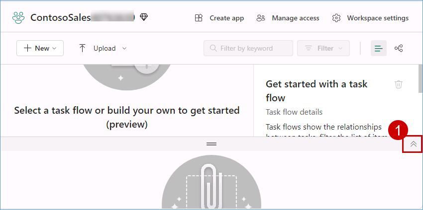
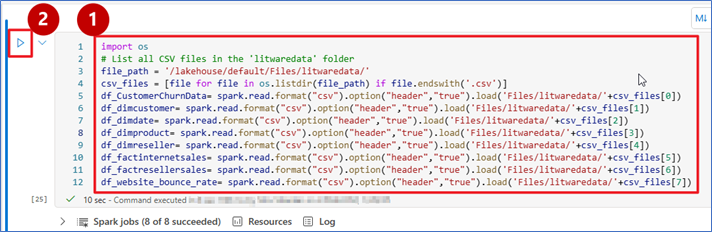
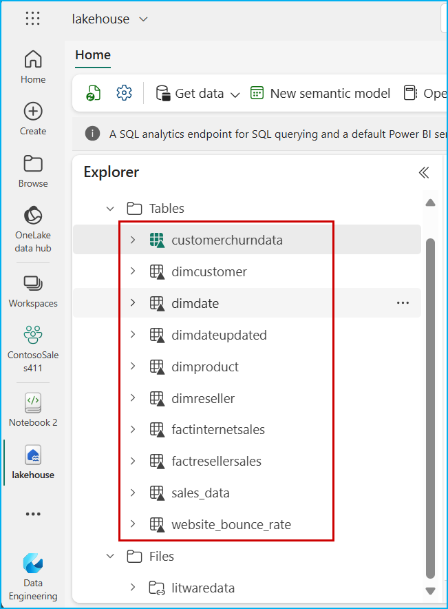
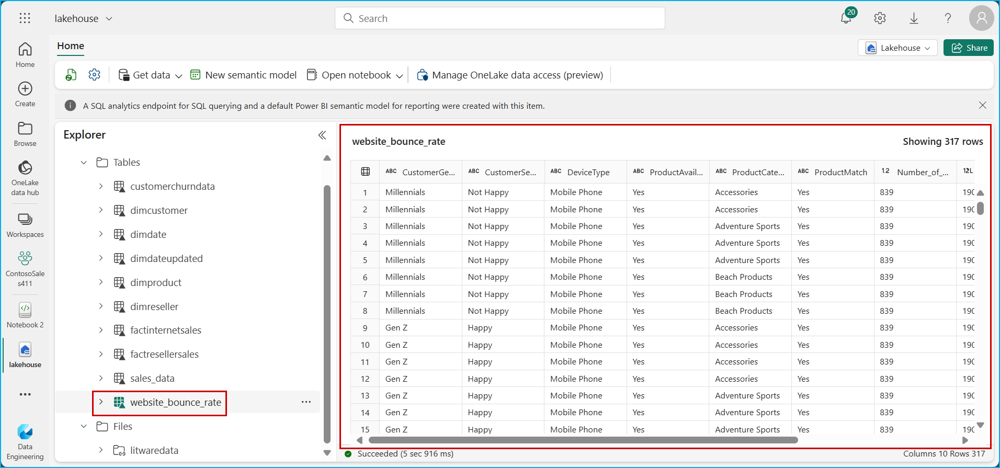
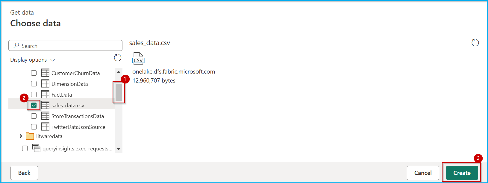
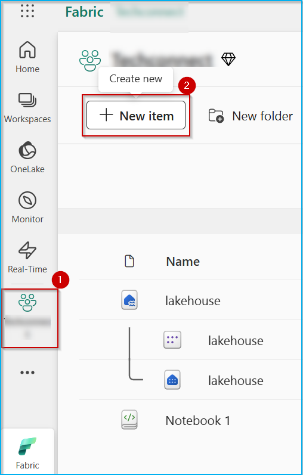

### Exercise 1: Data Engineering/Data Factory experience - Data ingestion from a spectrum of analytical data sources into OneLake

*Before we start executing the steps, we will open a backup Click-by-Click lab using the following hyperlink in a new tab and navigate back to the VM browser:* 

[Click-by-Click](https://regale.cloud/Microsoft/viewer/3088/modern-analytics-with-microsoft-fabric-copilot-and-azure-databricks-dream-lab-fu/index.html#/0/0)

*Now, let's trigger the Simulator App to start streaming data to EventHub (**to be used later in exercise 4**).*

1. Open a **Microsoft Edge browser** from VM desktop.

2. Click on browser address bar and click **<inject key= "WebAppBrowse" enableCopy="true"/>** to browse app service and press **Enter**.

>**Note**: **Do not click anywhere else on the screen until all of the text has been auto-filled.**

3. **IMPORTANT!! PROCEED WITH THE NEXT STEPS WHILE THIS LOADS.**


	


### Task 1.1: Create a Microsoft Fabric enabled workspace

In this exercise, you will act as the Data Engineer, Eva, to transfer Contoso's data from Azure SQL Database into the Lakehouse and initiate data preparation for the upcoming merger between Contoso and Litware Inc.

1. Open **Microsoft Fabric** in a new tab by copy pasting the below link.

```BASH
https://app.fabric.microsoft.com/home
```

2. Sign in with your Azure AD credentials. If you are not already signed in, you will be redirected to the Microsoft Fabric login page.


3. From the left navigation pane, click on **Workspaces** and then the **+ New workspace** button.

	

9. Type the name **<inject key= "WorkspaceName" enableCopy="false"/>** **validate** the available name and click **Apply**.

>**Note:** Only use the workspace name provided above.

>**NOTE:** If the name **<inject key= "WorkspaceName" enableCopy="false"/>** is already taken, refresh the page and check again. A workspace with that name may already be created. If so, add a different suffix until the name is available.


>**Note:** Close any pop-up that appears on the screen.


>**Note:** Wait for the Power BI Workspace to load.

<!-- >**Note**:  If you see the pop message **Upgrade to Power BI Pro License** perform the following steps. Otherwise, skip to the next exercise.

10. *Click on the **Try free** button.*
   

11. *Click on the **Got it** button to continue.*
    -->

<!-- 12. Click on **Workspaces** to verify if the workspace with the given name was created, if not perform the steps above again.

>**NOTE:** If the workspace you created is not visible, perform **step 8** again. -->
<!-- 
 -->


   
<!-- >**Note:** Click on the collapse icon, as shown in the screenshot below, for better visibility.

 -->

### Create/Build a Lakehouse

Now, let's see how each department can easily create a Lakehouse in the Contoso workspace without any provision. They simply provide a name, given the proper access rights of course!

1. Click on the **experience** button at the **bottom left** corner of the screen (In this screenshot, **Power BI** is selected as an "Experience") and then Select **Fabric**.


2. Click on the **three dots (ellipsis)** below the workspace.


3. In the new window, under Data Engineering, click **Lakehouse**.


**Note:** Screenshots in the exercises may sometimes differ from the actual lab. Please adjust your screen resolution to locate items and select them as needed.

4. Copy the name **lakehouse** from the following and paste it in the **Name** field.

```BASH
lakehouse
```

5. Click on the **checkbox** and then click on the **Create** button.

   

**Note:** Expand the Lakehouse Explorer if it is collapsed.

   

In just a few seconds, the Lakehouse is ready. With the right access, you, as a Data Engineer, can effortlessly create a new Lakehouse. There is no need to set up any storage accounts or worry about network, infrastructure, key vault, Azure subscriptions, etc.

---

### Task 1.2: Use the ‘New Shortcut’ option from external data sources

Now, this is something exciting! This section shows how easy it is to create Shortcuts without moving data. That is the power of OneLake! In this exercise, you will ingest the curated bounce rate data for Litware from ADLS Gen2 using the New Shortcut option. Let’s see how!

1. Click on the **three dots (ellipses)** on the right side of Files.

2. Click on **New shortcut**.

>**Note:** Make sure you create a shortcut under **files** and not under **tables** in the lakehouse explorer pane.


3. In the pop-up window, under **External sources**, select the **Azure Data Lake Storage Gen2** source.


>**Note:** Wait for the screen to load.

4. Select **Create new Connection**.

5. In the screen below, we need to enter the connection details for the ADLS Gen2 shortcut.


6. 6.Copy the **Data Lake Storage endpoint**: **<inject key= "storageEndpoint" enableCopy="true"/>** and paste it into the **URL** field.

8. Select **Organization account** in the **Authentication Kind**, and then click on **Sign in**.

9. Click on **Next** button.


9. Select the **data** and **litwaredata** checkbox and then click on the **Next** button.


10. Click on the **Create** button.


11. And there you go! Your shortcut is now ready! Click (do not expand) on the newly created shortcut named **litwaredata**.


Prior to Microsoft Fabric, departments in Contoso had to move the data they needed from other departments via time-consuming ETL processes. But look, now they have created shortcuts. No need to move any of this data. That is the power of OneLake!

### Task 1.3: Leverage Data Wrangler to profile and analyze data effectively and create Delta tables using Spark Notebook.

Now, let’s see how Data Engineer, Eva, Analyzed data by leveraging Data Wrangler and got the remaining data into OneLake by creating Delta tables using Spark Notebook. By using a Spark Notebook to create Delta tables, Eva can ensure more reliable, scalable, and efficient data management, which is essential for handling big data workflows.

1. Click on **Workspace** and select **New item**.


2. In the **New Item** tab, select **Notebook**.


>**Note:**  If the Pop-up appears click on **Skip tour**


3. Click on the **+ Data Sources** button and then select **Lakehouses**


4. Select **Existing Lakehouse with Schema** and then click on ***Add***.


5. Select the **lakehouse** and then click on **Add**


6. Once the notebook is created, paste the **below code** in the cell and **run** the cell.

```
import os
# List all CSV files in the 'litwaredata' folder
file_path = '/lakehouse/default/Files/litwaredata/'
csv_files = [file for file in os.listdir(file_path) if file.endswith('.csv')]
df_CustomerChurnData= spark.read.format("csv").option("header","true").load('Files/litwaredata/'+csv_files[0])
df_dimcustomer= spark.read.format("csv").option("header","true").load('Files/litwaredata/'+csv_files[1])
df_dimdate= spark.read.format("csv").option("header","true").load('Files/litwaredata/'+csv_files[2])
df_dimproduct= spark.read.format("csv").option("header","true").load('Files/litwaredata/'+csv_files[3])
df_dimreseller= spark.read.format("csv").option("header","true").load('Files/litwaredata/'+csv_files[4])
df_factinternetsales= spark.read.format("csv").option("header","true").load('Files/litwaredata/'+csv_files[5])
df_factresellersales= spark.read.format("csv").option("header","true").load('Files/litwaredata/'+csv_files[6])
df_website_bounce_rate= spark.read.format("csv").option("header","true").load('Files/litwaredata/'+csv_files[7])
```



7. In the notebook ribbon **Home** tab, use the Data Wrangler dropdown and select **dfcustomer** dataframe.


8. When Data Wrangler loads, it displays a descriptive overview of the chosen DataFrame in the **Summary** panel. Note that the table have no missing values and duplicate rows, similarly you can view data frames for other tables.


9. Since the data is already normalized will load it into Delta tables, paste the **below code** in the cell and **run** the cell.

```
import os
import pandas as pd
 
# List all CSV files in the 'litwaredata' folder
file_path = '/lakehouse/default/Files/litwaredata/'
csv_files = [file for file in os.listdir(file_path) if file.endswith('.csv')]
 
# Load each CSV file into a table
for file in csv_files:
    table_name = file.split('.')[0]
    df = pd.read_csv(file_path + file)
    spark.createDataFrame(df).write.mode("ignore").format("delta").saveAsTable(table_name)
```


10. Once the execution is successful, **stop the Spark session** and click on **Lakehouse**.


11. Expand **tables**, expand **dbo**, click on the **three dots**, and then click on **Refresh**. 


12. View the successfully **loaded tables**.



13. Click on **website_bounce_rate** delta table and view the website bounce rate data.



14. You now have all the tables in **OneLake** for Contoso to leverage. Next, we proceed with data transformation using Dataflow Gen2 to transform the sales data ingested from Litware. 


### Task 1.4: Leverage Dataflow Gen2 and Data pipelines for a "No Code-Low Code" experience to quickly ingest data with Fast Copy and transform it using Copilot

Using another great feature in Fabric’s Data Factory, called Fast Copy, Contoso’s Data Engineer, Eva, quickly ingests terabytes of data with dataflows, thanks to the scalable Copy Activity in the pipeline. With so much data from Litware, there is bound to be a lot of clean up needed. Let’s step into Eva’s shoes to explore how she used fast copy to ingest data and Copilot to transform it, just in time to derive meaningful customer insights before their big Thanksgiving Sale!

You will experience how easy it is to use Fast Copy to transform 100M rows of Litware's sales data into the Lakehouse.


1. Click on **Workspace** and select **New item** then Click on **Dataflow Gen2**.


2. Uncheck **Enable Git integration, deployment pipelines and public API scenarios (preview)** box, click on **create**.


3. Click on the top part of the **Get data** icon (**not on the dropdown arrow at the bottom of the icon**).


4. In the pop-up window, scroll down to **OneLake catalog** and click on **lakehouse**.


5. If you see a screen similar to the one shown below, click on the **Next** button otherwise move to the next step.


6. Expand **Files** and then expand **data**.


7. Scroll down and select the **sales_data.csv** checkbox, then **click** on the **Create** button.



8. Collapse the **Queries** pane and take a look at the sales dataset (**note that the first row of this dataset is not a header**).


> **Let's use Copilot to perform data cleansing.**

9. Click on the **Copilot** button, paste the **prompt** provided below in the following text box and click on the **send** icon.

+++In the table sales_data csv, apply first row as headers.+++


>**Note:** If Copilot needs additional context to understand your query, consider rephrasing the prompt to include more details.

10. Scroll to the right-hand side and observe the **GrossRevenue** and **NetRevenue** columns. You'll notice the there are some empty rows with null values.


> **Let's use Copilot to remove empty rows.**

11. Similarly, paste the prompt below in Copilot and click on the **send** icon.

+++Remove empty rows from GrossRevenue and NetRevenue columns.+++


12. Scroll to the right-hand side and observe the **GrossRevenue** and **NetRevenue** columns (**there are no empty rows with null values**).


>**Note:** Due to time constraints, we will not publish and run the Dataflow from the Pipeline.

>**Note:** Expand the queries pane collapsed earlier.

13. Right click on the **query** and then select **Require fast copy**.


14. Click on **Options**, scroll down to select **Scale** and tick **Allow use of fast copy connectors** checkbox then click on **OK**.

**Note:** If **Allow use of fast copy connectors** checkbox is already checked click on **OK**.


15. Click on **Add data destination**, select **Lakehouse**.


16. Click on **Next** button.


17. Expand the workspace **<inject key= "WorkspaceName" enableCopy="true"/>**, and select **lakehouse**.

18. Enter the table name as **sales_data_updated** and then click on the **Next** button.


18. Click on the **Save settings** button.


19. Click on the **Publish** button.


Congrats on completing this data transformation exercise! 

Now let's use Copilot in Data pipeline to leverage the data transformation activities.

1. Click on the **<inject key= "WorkspaceName" enableCopy="true"/>** worspace at the **left** pane of the screen, then click on **New item** button.



2. Click on **Data pipeline**.


3. Enter the name **pipeline** for the pipeline and click on **Create**.


4. Click on the **Copilot** icon in the top right corner of the screen.


5. In the Copilot pane, click on the predefined option **Ingest data** and the below text will be populated in the prompt text box.

+++Get data using copy data activity+++

6. Click on **Send** icon.


7. A **Copy Activity** is created and the next prompt text is loaded automatically in the text box.


8. Enter the below prompt in the text box and click on **Send** icon.

+++Source connection of "copy0" (Copy) is lakehouse;
Destination connection of "copy0" (Copy) is lakehouse+++


9. Enter the below prompt in the text box and click on **Send** icon.

+++table of Source connection "lakehouse" (Lakehouse) in "copy0" (Copy) is data/CampaignData/campaign-data.csv;
table of Destination connection "lakehouse" (Lakehouse) in "copy0" (Copy) is dbo.CampaignData+++


10. Click on the **Copy data** activity, scroll up the **Details pane**, click on the **Source** tab and click on the **Preview data**.


11. Review the data and then click on the **Run this pipeline** option in the Copilot pane.


12. Click on **Save and run**.


13. Wait for the pipeline run to complete successfully.


14. Scroll up in the Copilot window to the top and select **Summarize this pipeline** option. The below text will be populated in the prompt text box.

+++Summarize this pipeline+++

11. Click on **Send** icon.


12. Scroll down to review the summarization generated by Copilot.


As you know, Litware was primarily using Azure Databricks with their data stored in ADLS Gen2 before the acquisition. Post merger, as one unified company – Contoso – they decided to leverage Azure Databricks to build and manage reliable data pipelines via Delta Live Tables (DLT). Now, you will see the amazing power of Unity Catalog that Contoso’s data architects used to quickly learn all about Litware's data without having to go through tons of documents. And all by simply leveraging AI and data intelligence.
