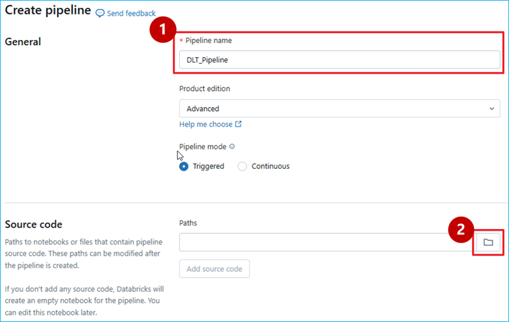

### Exercise 2: Azure Databricks integration with Microsoft Fabric: DLT Pipelines, Unity Catalog (Data governance), and Mirrored Azure Databricks Catalog

This exercise shows how Microsoft Fabric with Databricks enabled Contoso to solve their integration challenges. The acquired company, Litware Inc., was already using Databricks heavily and they stored their churn and sales data in ADLS Gen2. We’ll see how Unity Catalog benefited Contoso’s data architects so they could quickly get up to speed on all Litware Inc.’s data.

### Task 2.1: Create Delta Live Table pipeline (For Data Transformation)

Delta Live Tables (DLT) allow you to build and manage reliable data pipelines that deliver high-quality data in Lakehouse. DLT helps data engineering teams simplify ETL development and management with declarative pipeline development, automatic data testing, and deep visibility for monitoring and recovery.

1. Go back to the browser tab of **Resource Group** .

    Search for the Azure Databricks in the Resource group search field and click on **adb-techconnect....**.

    

2. Click on the **Launch Workspace**.

    

    **Note:** Click on the **Sign in with Microsoft Entra ID** button.

    

3. Scroll down in the left navigation pane and click on **Delta Live Tables**.

    

4. Click on the **Create pipeline** button.

    

5. Enter the name of the pipeline as **DLT_Pipeline** , scroll down to **Paths** and click on the **file icon** to browse the notebook.

    ```BASH
    DLT_Pipeline
    ```

    

6. Click on **Shared**, click on **Analytics with ADB**, click on the **01 DLT Notebook** and then click on the **Select** button.

   

7. Type **dbo** in **Default schema** feild and click on the **Create** button.

   

8. Click on the **Start** button.

    

    >**Note**: The pipeline will take 5-7 minutes to complete. In the meantime, you can move on to the next section and return to this one afterward.

9. Once the execution is completed, we will see a result similar to the one in the following screenshot.

     

This beautiful lineage view showing the Medallion Architecture is a data design pattern commonly used in Databricks to organize and optimize data processing workflows in a lakehouse architecture. It structures data into three logical layers—Bronze, Silver, and Gold—ensuring data quality, accessibility, and scalability for analytics and machine learning.

---

### Task 2.2:  Explore the data in the Azure Databricks environment with Unity Catalog (Unified Governance Solution for Data and AI)

We saw how Contoso utilized DLT pipelines to create a Medallion architecture on their data. Now let’s look at how data governance was managed on this curated data across the organization and made easy with Unity Catalog.
 
With the acquisition of Litware Inc., Contoso had a lot of data integration and interoperability challenges. They wanted to make sure that the transition was smooth, and their data engineers and data scientists could easily assimilate the data processed by Azure Databricks. Thankfully, they were able to leverage Gen AI features right within Azure Databricks to understand and derive insights from this data.

>**Note**: Due to time constraints, the following steps will be completed via an online Click-by-Click exercise.
>Please follow the green beacons for this exercise.
- This exercise will be performed outside the VM browser.
- Please return back to the VM browser once you see the **End of Task 2.2** screen.
- Once you press the **Agree** button, press the **A** key on your keyboard if you do not see the annotations.
	
1. Click on the [**hyperlink**](https://regale.cloud/Microsoft/play/4251/azure-database-unity-catalog#/0/0)

2. Continue with the next task.

### Task 2.3: Create a Mirrored Azure Databricks Catalog in Microsoft Fabric and analyze data using T-SQL

Mirroring the Azure Databricks Catalog structure in Microsoft Fabric allows seamless access to the underlying catalog data through shortcuts. This means that any changes made to the data are instantly reflected in Microsoft Fabric, without the need for data movement or replication. Let’s step into Data Engineer, Eva’s shoes to create a Mirrored Azure Databricks Catalog and analyze the data using T-SQL. 

1. Navigate back to the Microsoft Fabric tab on your browser (https://app.fabric.microsoft.com).

2. Click on the **<inject key= "WorkspaceName" enableCopy="true"/>** and select **New item** from menu bar.

    

3. In the **New item** window, scroll down and click on **Microsoft Azure Databricks catalog (preview)**.

   

4. When the **New source** window pops up, click on the **Create new connection** radio button.

   

5. In the URL field enter **<inject key= "databricksurl" enableCopy="true"/>**

6. Now, select **Service principal** from 'Authentication kind' dropdown box, and enter the following details.

- Tenant ID: **<inject key= "TenantID" enableCopy="true"/>**
- Service principal client ID: **<inject key= "ClientID" enableCopy="true"/>**
- Service principal Key: **<inject key= "Secret" enableCopy="true"/>**

7. click on the **Connect** button.

   

8. Click on the **Next** button.

   

9. In the **Choose data** screen, select the Catalog name as **litware_unity_catalog** from the dropdown box, and ensure **default** and **rag** schema is selected, then select the checkbox **Automatically sync future catalog changes for the selected schema** (to mirror future tables) if not ticked and click on **Next** button.

     

10. In the **Name** field enter **litware_unity_catalog** for your mirrored Databricks Catalog and click on the **Create** button.

    ```BASH
    litware_unity_catalog
    ```

    

11. Click on the **Monitor catalog** button to track the mirroring **Status** and then close it.

    

12. Click on the **View SQL endpoint** button. You can also select the tables to preview data.

    

<!--

#### Analyze the Mirrored Azure SQL Database data using T-SQL

Each mirrored Azure SQL database has an autogenerated SQL analytics endpoint that provides a rich analytical experience on top of the tables created by the mirroring process.

This means Contoso’s marketing data from SQL database is accessed seamlessly in Microsoft Fabric with zero ETL, and it is always kept In Sync automatically in Microsoft Fabric. Once the mirroring was up and running, Data Engineer, Eva, was able to access the tables in SQL Database and integrate the data in minutes. Let’s step into her shoes and see how it’s done!

1. Continuing from the previously created Mirrored SQL DB window, select **SQL analytics endpoint** from top right dropdown box.


2. Expand the **Schemas** and click on **DimProduct** table to see data preview. and then click on **New SQL query** button from the menu bar.

    

    **Note:** Click on the **Refresh** button if you are not able view the Tables.

3. Copy the following **SQL query** in query editor to explore mirrored data and perform your analysis.

    ```BASH
    Select distinct [ProductName] 
    from [FactSales] as fct
    left join [DimProduct] as prd
    on fct.[ProductKey]=prd.[ProductKey]
    where [SalesAmount] > 6000
    ```

4. Click on **Run** and view the results.

    

-->
