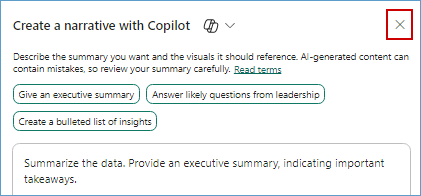

### Exercise 3: Power BI Experience in Fabric

With the wide spectrum of data sources and Litware's data in OneLake, it is now time to get some awesome insights and visualizations from this data. Let's dive deep into the experience of the Business Analyst, Wendy, and do just that.
 
### Task 3.1: Create a Semantic model and generate insights using Copilot for Power BI

Based on all the gathered data, Wendy is expected to create Power BI reports for other data citizens and stakeholders. Let's step into her shoes to experience the power of Copilot for Power BI in conjunction with Direct Lake Mode.

1. Navigate back to the Microsoft Fabric tab on your browser.

2. Click on **Workspaces** and select **<inject key= "WorkspaceName" enableCopy="true"/>**.


3. Click on **Filter** and select **Lakehouse**.


4. Click on the **lakehouse**.

>**Note:** There are 3 options for lakehouse, namely Lakehouse, Semantic model (Default) and SQL endpoint. Make sure you select the **Lakehouse** option.


5. Click on the **New semantic model** button. 


6. In the **Name** field, enter ```website_bounce_rate_model```.

7. Select workspace as **<inject key= "WorkspaceName" enableCopy="true"/>** and click on expand icon next to **dbo** checkbox.


8. Click on expand icon next to **Tables** checkbox.


9. Scroll down if you see a scroll bar and select **website_bounce_rate** table and click on the **Confirm** button. 


>Wait for the semantic model creation.

10. To create a new report using this semantic model, click on **File** and select **New Report** in the top bar.
 


11. Click on **Settings** icon and select **Power BI settings** from the 'Resources and extensions' section.

>**Note:** If the settings icon is not visible, click on the three dots next to Profile icon and select Settings.


12. Select **Semantic models** tab and select your Semantic model.


13. Scroll down to **Q&A** section and expand it, then select **Turn on Q&A to ask natural language questions about your data** checkbox, and click on **Apply**.


14. Click on **Untitled report** from the left pane.


15. Click on the **Copilot** icon and collapse the other panes named Filters, Visualizations and Data.


>**Note:** Close any pop-up that appears on the screen.


16. Click on **Preview** button to the right side to enable it and click on **Get started**.


You will now see how easy it is for the data analyst to create compelling Power BI reports and get deep insights with literally no hands-on coding!
	
17. Click on the **Prompt Guide** button.

  

18. Select the option **What's in my data?**

> **Note:** If you don't see the 'What's in my data?' option, click in the **Copilot chat box** field, enter the prompt below, and click the **Send** button: 

```
What's in my data?
```


The first option, 'What’s in my data?' provides an overview of the contents of the dataset, identifies and describes what’s in it and what the attributes are about. So, there’s no need to wait for someone to explain the dataset. This improves the efficiency and volume of report creation.


19. Click on the Copilot chat box field and enter the prompt below.

```
Create a report Bounce Rate analysis, to show the correlation between customer sentiment, particularly among millennials and Gen Z, unsuccessful product searches across different devices, and the website's bounce rate by customer generations.
```  

>**Note:** Wait for the prompt to populate.

20. Click on the **Send** button and wait for the results to load. 


	
>**Note:** If you see the error message saying, 'Something went wrong.', try refreshing the page and restart the task. Being in a shared environment, the service may be busy at times.
- If Copilot needs additional context to understand your query, consider rephrasing the prompt to include more details.

>**Note:** The responses from Copilot may not match the ones in the screenshot but will provide a similar response.


Based on this report, we notice that the website bounce rate for Contoso is especially high amongst the Millennial customer segment. Let’s ask Copilot if it has any recommendations for improving this bounce rate based on the results and data in the report.

We’ll ask Copilot for suggestions based on the results and data in the report. 

21. Enter the following prompt in Copilot, and press the **Send** button.

```
Based on the data in the page, what can be done to improve the bounce rate of millennials?
```

	

	
22. Look at the suggestions Copilot provided. Copilot creates the desired Power BI report and even goes a step further to give powerful insights. Wendy realizes that for the website bounce rate to improve, Contoso needs to transform their mobile website experience for millennials. This helps them reduce their millennial related customer churn too! Now, what if Contoso’s leadership team needed a quick summary of this entire report? **Smart Narrative** to the rescue! 
	

	
23. Expand the **Visualizations** pane and select the **Narratives** visual. 


24. Click on **Copilot (preview)** within the visual.


	
25. Select **Give an executive summary**. 

26. Click on **Update** and observe the generated summary. See how easy it was to get an executive summary with absolutely no IT resource dependency!
 
>**Note:** If you don't see 'Give an executive summary' option, click on the **Copilot narrative** chat box field, enter the prompt below, and click on **Update** :

```
Summarize the data, provide an executive summary, indicating important takeaways.
```


30. Expand the narrative from the corner to get a better readable view of the result.


31. Click on the **Close** button in the pop-up window.


	
The summary could also be generated in another language, if specified. Additionally, the summary updates if you filter the report on any visual.