### Exercise 4: Explore Data Science experience in Microsoft Fabric (Optional)
 
Microsoft Fabric offers Data Science experiences to empower users to complete end-to-end data science workflows for data enrichment and business insights. You can complete a wide range of activities across the entire data science process, all the way from data exploration, preparation and cleansing to experimentation, modeling, model scoring and serving predictive insights to BI reports.

### Task 4.1: Build ML models and experiments using Copilot in Microsoft Fabric

   

To understand the cause behind Contoso’s declining revenue, the team needed to dive deeper into their customers’ spending pattern.

Copilot responds to queries in natural language or generates customized code snippets for tasks like creating charts, filtering data, applying transformations, and building machine learning models.

Let’s see how Copilot for Notebook helps you, as a Data Engineer, quickly create Data Science Notebooks.


1. Click on the **<inject key= "WorkspaceName" enableCopy="true"/>** workspace from the left navigation pane.

   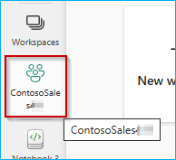

   **Note:** Click on **Don't save** if this pop-up appears.

     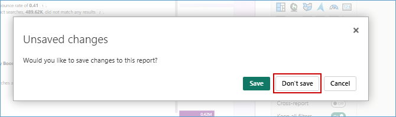

2. Click on **Import** dropdown, select **Notebook** and then select **From this computer**

   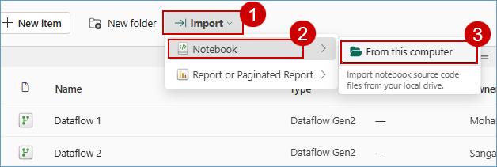

   **Note:** If the Import option is not visible, click the **three dots (ellipsis)** button and select Import.

3. Click on the **Upload** button.

   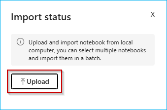

4. Browse to the fabricnotebooks folder in your VM  by following the path `C:\LabFiles\techconnect\artifacts\fabricnotebooks` and then select **Build ML models and experiments using Copilot for Data Science in Microsoft Fabric** notebook.

5. Click on the **Open** button.

   

6. Wait for the notebook to **upload**.

   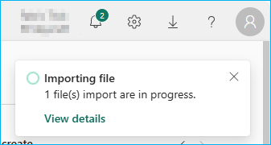


7. Click on **Filter**, expand **Type** and select **Notebook**.

   

8. Click on the **Build ML models and experiments using Copilot for Data Science in Microsoft Fabric** notebook.

   

9. Click on **Lakehouses** in the Explorer pane.

   

10. Click on **Missing Lakehouses** and then click on **Remove all Lakehouse**.

    

11. Click on the **Continue** button.

      

12. Click on the **+ Lakehouse**.

     

13. Make sure that **Existing Lakehouse with schema** radio button is selected and then click on the **Add** button.

    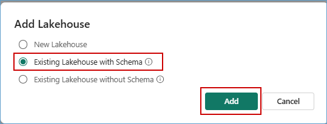

14. Select the **lakehouse** checkbox.

    

15. Click on the **Add** button.

    

16. Click on the **Copilot** button and then click on the **Get Started** button.

    

     **Note:** If the **Copilot** option is not visible, click the **three dots (ellipsis)** button and select Copilot.

17. Run the **first cell** of the notebook to install the copilot packages.

    >**Note:** This may take a while to execute, please wait till this loads completely.
    >**Note:** If you encounter an error, you can ignore it and proceed to the next step.

    

    >**Note:** Once the execution is completed, the output will appear as shown in the screenshot.

       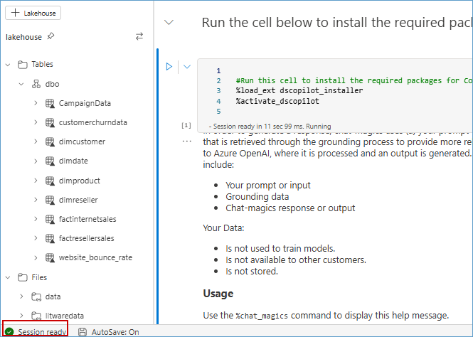

18. Copy and paste the **below prompt** in the textbox.

      ```
      Please load "customerchurndata" table from the Lakehouse into a Spark DataFrame. Then convert that into pandas dataframe as df.
      ```

19. Click on the **send** button.

    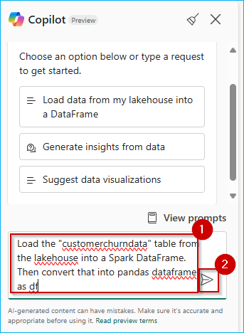

20. Click on the **Copy code** icon.

    >**Note:** The new cell will be created right above the cell.

    

21. Click on a **+ Code** above the first cell of the notebook.

    

22. Paste the **copied query** and run the new **cell**.

     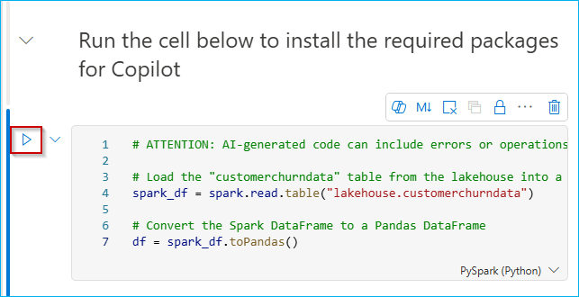

    **Note:** Copilot may not respond as expected,please copy and paste the following code to obtain the result:

      ```
      # Load the table into a Spark DataFrame
      spark_df = spark.table('lakehouse.dbo.customerchurndata')
      
      # Convert the Spark DataFrame to a pandas DataFrame
      df = spark_df.toPandas()
      ```


With the data prepared with the help of Copilot, Data Scientists like you can explore the data to understand the patterns it contains.

The rest of the notebook has similar PySpark queries to explore customer churn prediction.

### Task 4.2: Predicting Customer Churn using New AutoML in Microsoft Fabric

1. Click on the **<inject key= "WorkspaceName" enableCopy="true"/>** workspace from the left navigation pane.

   

2. Click on **New item**, scroll down and select **Notebook**.

   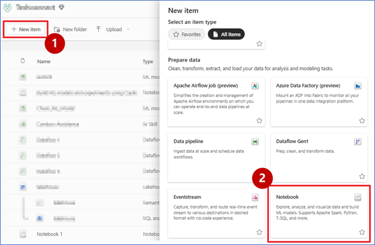

3. Click on the **notebook name** at the top corner and enter **Build ML models and experiments using AutoML** in the Notebook **Name** feild. 

    ```BASH
    Build ML models and experiments using AutoML
    ```

   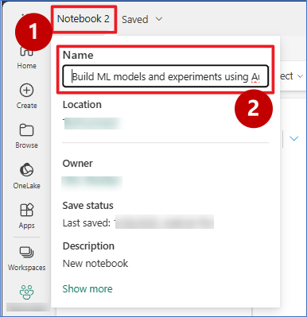

4. Click on the **+ Data Sources** button and then select **Lakehouses**

   

5. Select **Existing Lakehouse with Schema** radio button and then click on the **Add** button.

   

6. Select the **lakehouse** checkbox and then click on the **Add** button.

    

7. Click on **New AutoML Run** icon.

   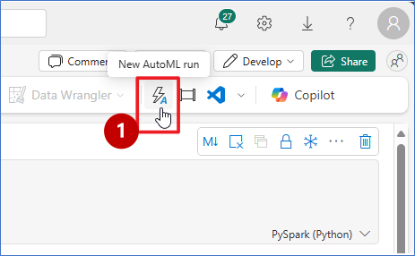

    **Note :** If the **New AutoML Run** option is not visible, click the **three dots (ellipsis)** button and select **New AutoML Run**.

     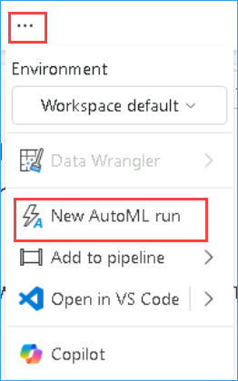

8. Click on **lakehouse** and then click on the **Next** button.

   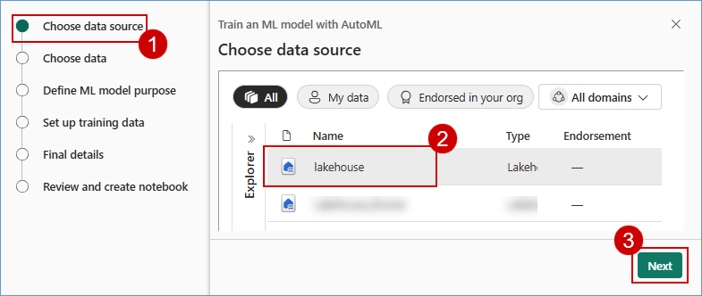

9. Select **customerchurndata** table and click on the **Next** button..

    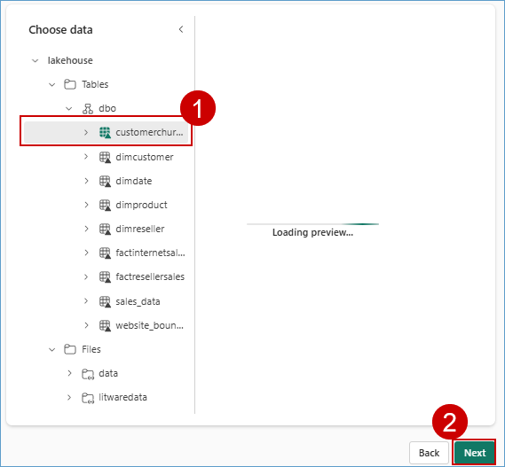

10. Select **Binary Classification** and click on the **Next** button.

    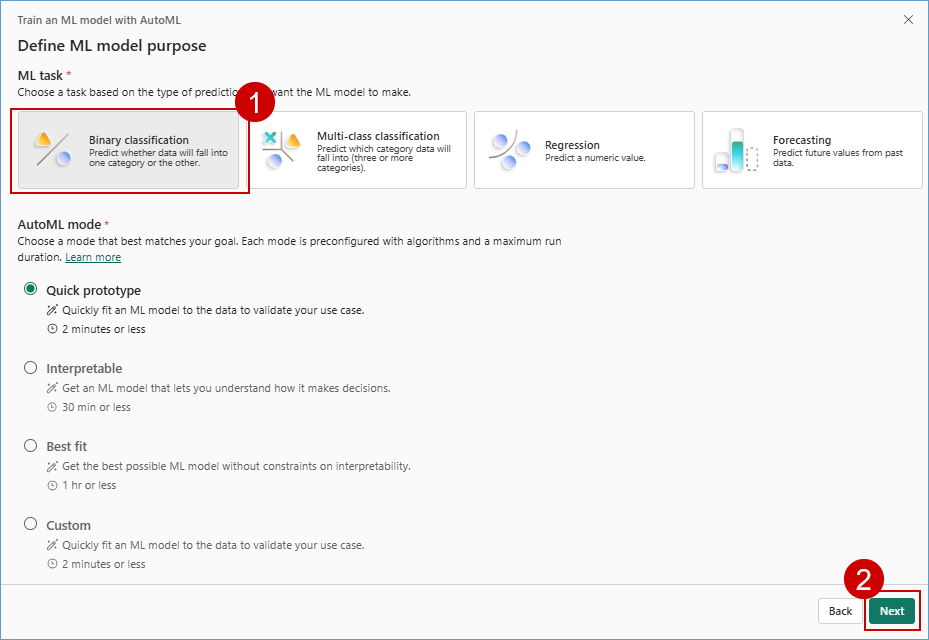

11. In **Choose prediction column** dropdown select **churn** and then click on the **Next** button.

    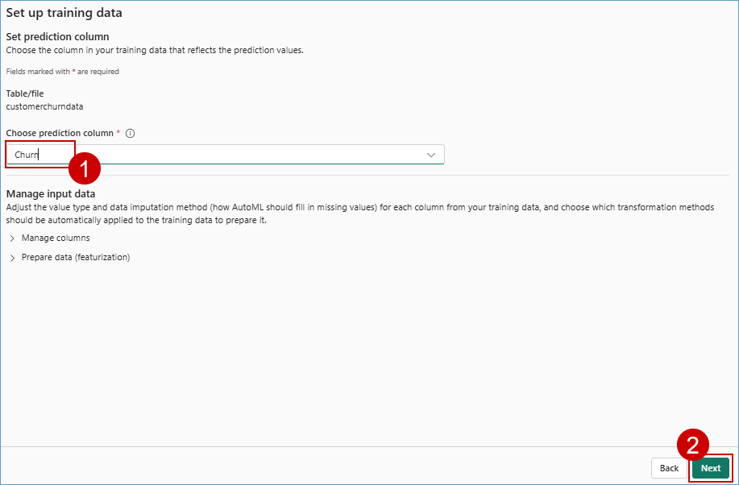

12. Click on the **Next**.

     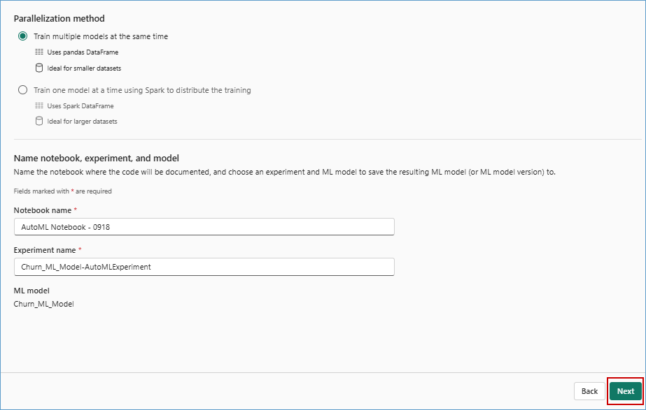

13. Review the Summary and the click on the **Create** button to generate AutoML notebook.

     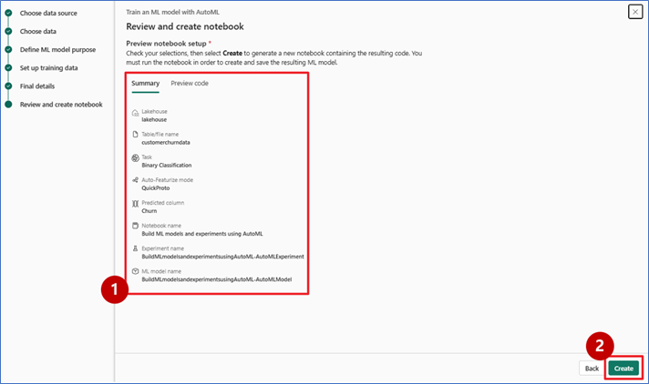

    >**Note:** Wait for 20 to 30 seconds for the notebook to load.

14. Since the data has already been normalized lets comment out function used for featurization, click on the notebook from the left navigation and scroll down in the Notebook to the **Step 2: Featurization** section. Locate cell number 2 within this section, and comment out lines 10 and 11 by adding **#** symbol at the beginning of each line, as shown in the screenshot.

    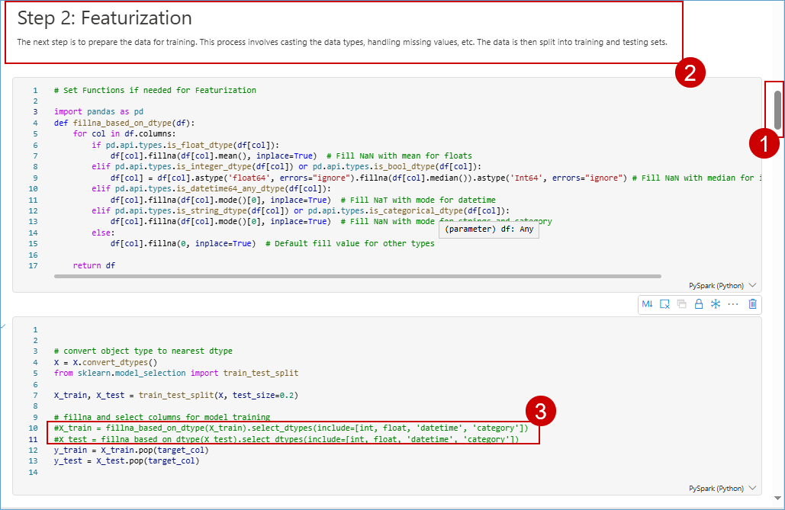
 
<!--
14. Click on **Environment** dropdown from the ribbon and select **New Environment**.

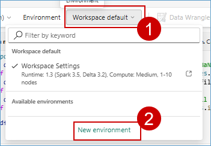

15. In the **Name** feild enter ``Myenv``.


16. Navigate back to the notebook from the left navigation pane.


17. Click on **Environment** dropdown from the ribbon and select **Myenv**.

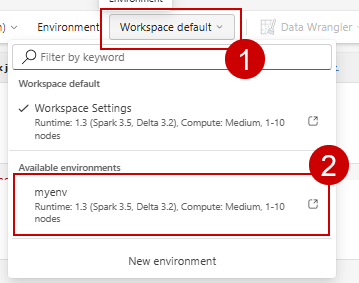

-->

15. Click on **Run all** from the ribbon.

    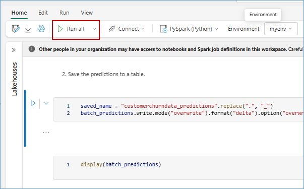

    **Note:** It takes approximately 5-8 min to complete execution.

16. Notice the cells as they get exexuted, **scroll down** to check next cell.

    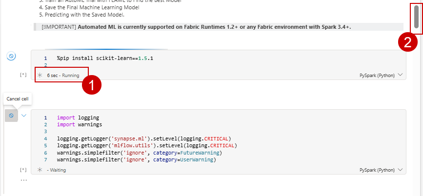

17. **Scroll down** and notice prediction results generated from the model.

    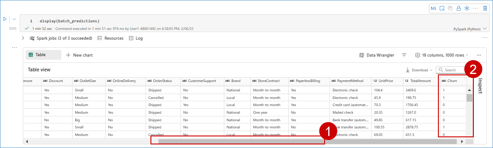

18. **Scroll down** to the last cell, observe the prediction being saved in the table in OneLake.

    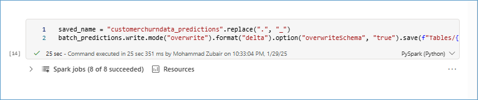

### Task 4.3: Leverage AI skills for Q&A

AI Skill, a new capability in Microsoft Fabric, allows Data Analysts like Serena to create their own generative AI experiences. Serena believes that generative AI offers a transformative way to interact with data, significantly boosting data-driven decision-making in organizations worldwide. 

In this exercise, you’ll step into Data Analyst, Serena’s shoes and leverage AI Skill to create conversational question-and-answer (QnA) systems. 


1. Click on the **<inject key= "WorkspaceName" enableCopy="true"/>** workspace from the left navigation pane.

   

2. Click on **New item** and search for **AI Skill**. select **AI Skill(Preview)**.

    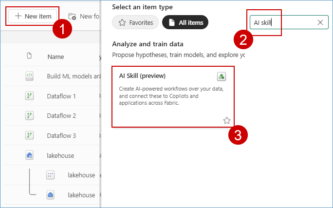

3. In the Name field as enter **Contoso-Assistant** 

    ```BASH
    Contoso-Assistant
    ```

    

4. Click on **lakehouse** and then click on the **Confirm** button.

   

5. Click on **Refresh**, expand **Tables**, then expand **dbo**, and select the following tables as shown in the screenshot.

- dimcustomer
- dimdate
- dimproduct
- dimreseller
- factinternetsales
- factresellersales

   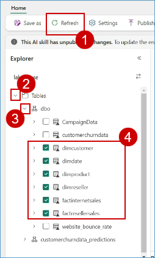

6. Click on the **Get Started** button.

   

7. Type **What is the most sold product?** in the chatbox and click on the **Send** icon.

    ```BASH
        What is the most sold product?
    ```

   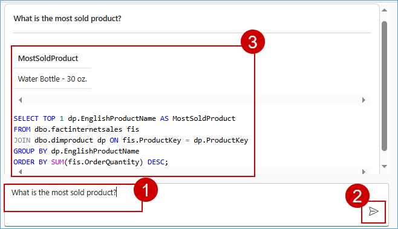

    **Note:** This may take some time; wait until a response is received.

8. AI Skill answered the question fairly well based on the selected tables.

   However, the SQL query needs some improvement, it orders the products by order quantity, when total sales revenue associated with the product is the most important consideration, as shown in the above screenshot.

   To improve the query generation, let's provide some instructions, as shown in these examples:

   ```
   Whenever I ask about "the most sold" products or items, the metric of interest is total sales revenue and not order quantity.

   The primary table to use is FactInternetSales. Only use FactResellerSales if explicitly asked about resales or when asked about total sales.
   ```

9. Copy the above notes and paste it in **Notes for model** box. Type **What is the most sold product ?** in the chatbox and then click on the **Send** button.  

    ```BASH
        What is the most sold product?
    ```

    Asking the question again returns a different answer, **Mountain-200 Black, 46**, as shown in the below screenshot:

    

   In addition to instructions, examples serve as another effective way to guide the AI. If you have questions that your AI skill often receives, or questions that require complex joins.

10. In the example SQL queries click on **edit** icon.

    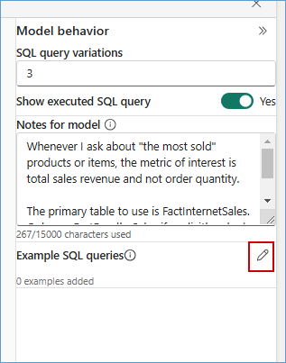

11. Click on **+ Add example** and enter the following question and their respective SQL queries.

    

    |Question| SQL query|
    |--------|----------|
    |who are the top 5 customers by total sales amount?|SELECT TOP 5 CONCAT(dc.FirstName, ' ', dc.LastName) AS CustomerName, SUM(fis.SalesAmount) AS TotalSpent FROM factinternetsales fis JOIN dimcustomer dc ON fis.CustomerKey = dc.CustomerKey GROUP BY CONCAT(dc.FirstName, ' ', dc.LastName) ORDER BY TotalSpent DESC;|

    >**Note** : After entering the first example and query, click the **+ Add Example** button.

12. Click on **close(X)** button.

    

13. Type **who are the top 5 customers by total sales amount?** in the chatbox and click on **Send** button.

    ```BASH
    who are the top 5 customers by total sales amount?
    ```

    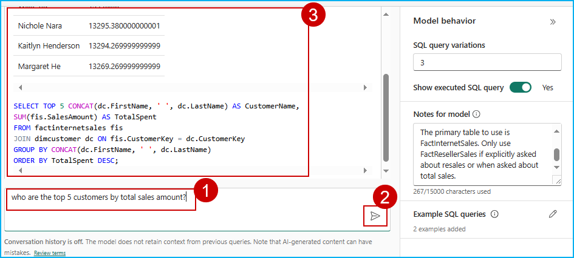

14. Click on **Publish**.

    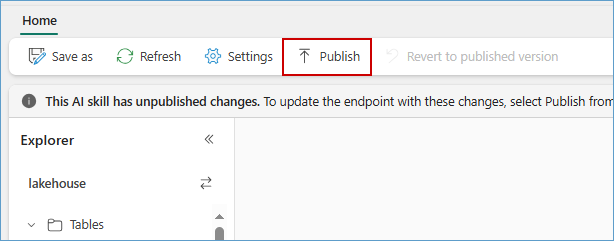

15. In the pop-up screen click on the **Publish** button.

    

16. Notice that AI skill is published successfully.

    
