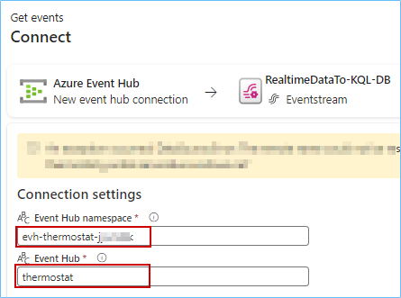
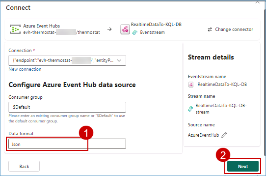

### Exercise 5: Real-time Intelligence experience - Explore Streaming data using Copilot for KQL DB

Imagine, it is 6 am on the day of Contoso's big Thanksgiving sale. Customers are flocking to their stores in large numbers. We are about to witness the very culmination of Contoso's phenomenal transformation with Microsoft Fabric and Azure Databricks. Specifically, we will see how near real-time data is used to make decisions for the next moment in Contoso's stores to ensure optimal temperatures are maintained for their customers while they shop at the big sale!

### Task 5.1: Ingest real-time/historical data into Eventhouse using Eventstream

In the exercise, we’ll explore how Data Engineer, Eva, ingested real-time data from the event hub into the KQL Database to monitor in-store temperatures in real time.  

1. Select **<inject key= "WorkspaceName" enableCopy="true"/>** workspace from the left navigation pane, click on **+New item**, then scroll down to the **Store data** section, and click on **Eventhouse**.

   

    >**Note:** If you see a pop-up like the following one, click on the **Don't save** button.

      

    **Note:** Screenshots in the exercises may sometimes differ from the actual lab. Please adjust your screen resolution to locate items and select them as needed.

2. Enter the name **Contoso-Eventhouse**

   ```BASH
   Contoso-Eventhouse
   ```

3. Click on the **Create** button and wait for the database to be created.

   

   >**Note:** If you see a pop-up like the one in the following screenshot, ignore it and proceed with the next step.

   

4. Select **<inject key= "WorkspaceName" enableCopy="true"/>** workspace from the left navigation pane, click on **+New item**, then scroll down to the **Prepare data** section, and click on **Eventstream**.

   

   **Note :** If you have 10 items in the left navigation, you won't be able to create an Eventstream. Remove any unnecessary items and then proceed to create the Eventstream.


5. Enter the name as **RealtimeDataTo-KQL-DB** and click on the **Create** button.

    ```BASH
    RealtimeDataTo-KQL-DB
    ```

   

6. Click on **Add external source**. 

   

7. Click on the **Connect** button beside **Azure Event Hubs**.

   

8. Under **Connection**, click on **New connection**.

   

9. Enter the value for the **Event Hub namespace** as **<inject key= "eventhubNamespace" enableCopy="true"/>** and enter the **Event Hub** value as thermostat.

   ```BASH
   thermostat
   ```

   

10. Navigate back to the Resource Group <inject key="resourcegroup" enableCopy="false"/> in the Azure Portal, and search for **Event Hubs Namespace** and click on **<inject key="eventhubNamespace" enableCopy="false"/>**.

    

11. Scroll down in the left navigation pane and click on **Event Hubs** under the **Entities** section.

    >**Note:** If the **left navigation** bar is collapsed, click on the **hamburger icon** at the top to expand it.

    

12. Click on the **thermostat event hub**.

    

13. Click on **Shared access policies** in the left pane under Settings, then click on **thermostat** and finally copy the **primary key** and paste it in a notepad for further use.

    >**Note:** Expand the **settings** option if the left navigations are collapsed.

    

14. Go back to the **Microsoft Fabric** and scroll down and select **Shared Access Key** from Authentication kind dropdown, enter the Shared Access Key Name as **thermostat** and then **enter** the value copied in the earlier step for **Shared Access Key** and then click on the **Connect** button.

    ```BASH
        thermostat
    ```

    

    >**Note:** Close any pop-up which appears on screen.

    

15. Select Data format as **JSON** and click on the **Next** button.

    

    >**Note:** Wait for the connection to be established.

16. Click on the **Add** button.

    

17. In the Eventstream canvas, click on the **Add destination** dropdown and select **Eventhouse**.

    

18. Select the **Event processing before ingestion** radio button, enter **RealTimeData** as the Destination name.

    ```BASH
    RealTimeData
    ```

19. In the **Workspace** field select **<inject key= "WorkspaceName" enableCopy="true"/>**. 

20. In the **Eventhouse** dropdown select **Contoso-Eventhouse**.

21. In the **KQL Database** dropdown select **Contoso-Eventhouse**.

22. Click on the **Create new** button under Destination table.

    

23. Enter the table name as **thermostat** and then click on the **Done** button.

    ```BASH
    thermostat
    ```

    

24. Enter the Input data format as **Json** and then click on the **Save** button.

    >**Note:** Zoom-out on your screen if the **Input data format field** is not visible.

    

25. Drag Arrow from RealtimeDataTo-KQL' and connect it to **RealTimeData**.

    

26. Click on the **Publish** button.

    

    >**Note:** Wait for the data ingestion from EventHub to KQL DB.

27. Once you see that the streaming has started, click on **Refresh** and wait for the data to preview.

    

    Real-time data from the event hub has been ingested successfully into the KQL Database. Next, as customers walk in aisles and the temperatures fluctuate, let us see how KQL queries proactively identify anomalies and help maintain an optimal shopping experience!

---

### Task 5.2: Analyze/discover patterns, identify anomalies and outliers using Copilot

Kusto Query Language is a powerful tool. In this scenario KQL is used to explore Contoso’s data, discover patterns, identify anomalies and outliers, create statistical modeling, and more.

We use KQL to query the thermostat data that’s streaming in near real-time from the devices installed in Contoso’s stores.

1. Select **<inject key= "WorkspaceName" enableCopy="true"/>** workspace from the left navigation pane, click on **+New item**, then scroll down to the **Track data** section, and click on **KQLQueryset**.

   


2. In the KQL Queryset name field, type **Query Thermostat Data in Near Real-time using KQL Script** and click on the **Create** button.

   ```BASH
   Query Thermostat Data in Near Real-time using KQL Script
   ```

   

3. **Wait** for the query set creation and a new screen will display. In this screen, click on **Contoso-Eventhouse**, verify the workspace name and then click on the **Connect** button.

   

4. Place your cursor inside the **query** field, select all using **Ctrl + A** and **delete** the pre-written query.

   

5. Click on the **Copilot** button.

   

6. **Paste** the following query provided below in the Copilot query section.

    ```BASH
      Create a query to summarize average temperature every 1 min in line chart
    ```

7. Click on the **Send** icon.

    >**Note:** If you receive a response from Copilot such as "I am not sure" please ask the question again.

    >**Note:** The responses from Copilot may not match the ones in the screenshot but will be a similar one.

8. Click on the **Insert** button.

    

9. Place your cursor in the **script field**, click on the **Run** button and you get the desired result.

    

Imagine one of the aisles had a sudden rise in temperature due to an anomaly. Customers start leaving that aisle and the wait times in the checkout lines start to increase but thanks to the KQL Queries, those anomalies would be tracked, and immediately notifications would be generated to bring the aisle temperature back to optimal levels!
