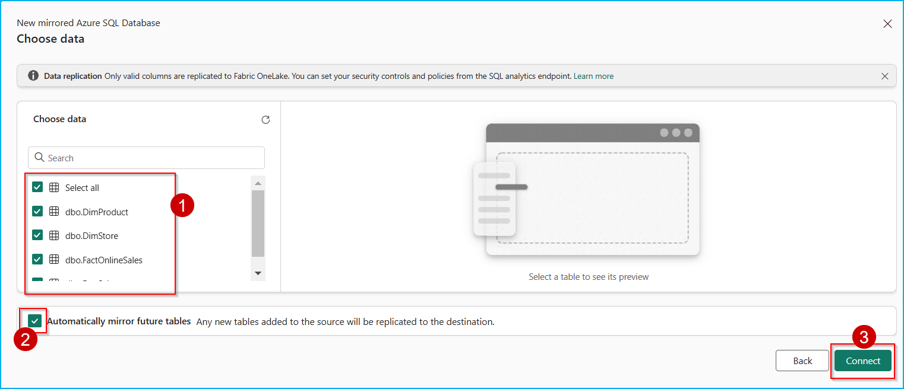
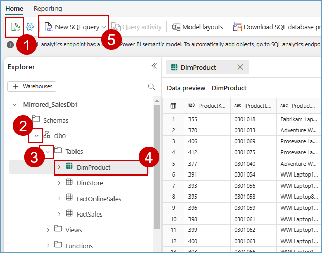

### Exercise 6: Mirroring SQL in Microsoft Fabric (Optional)

### Task 6.1: Azure SQL DB Mirroring in Data Warehouse

Mirroring in Microsoft Fabric provides an easy experience to avoid complex ETL (Extract Transform Load) and integrate your existing Azure SQL Database estate with the rest of your data in Microsoft Fabric.

Litware had a lot of their marketing data in the Azure SQL DB, so Contoso used Database Mirroring to help further reduce their data movement and dependency on different systems. 

1. Navigate to the **Microsoft Fabric** tab on your browser (https://app.fabric.microsoft.com).

2. Click on your **<inject key= "WorkspaceName" enableCopy="false"/>**, and select **+ New item** from menu bar.

   

3. In the **New item** window, search for **SQL** in the search bar then select **Mirrored Azure SQL Database**.

   

4. When prompted to **Choose a database connection to get started**, look for **New sources** and select **Azure SQL database**.

   

5. In the **Server** field, paste **<inject key= "mssqlServer" enableCopy="true"/>**

6. In **Database** field paste **SalesDb**

   ```
      SalesDb
   ```

   

7.  Scroll down and select **Basic** for Authentication kind, enter **labsqladmin** as the **Username**, **Smoothie@2025** as the **Password** and click on the **Connect** button.

    ```BASH
      labsqladmin
    ```
    ```BASH
      Smoothie@2025
    ```
    

    >**Note:** Close any pop-up that you see throughout the lab.

8. In the **Choose data** screen, you can select the tables to be mirrored into Microsoft Fabric, then select the checkbox **Automatically mirror future tables** and click on the **Connect** button.

   

9. Enter the name for your mirrored database as **Mirrored_SalesDb1** and click on the **Create mirrored database** button.

    ```BASH
    Mirrored_SalesDb1
    ```

    

10. Wait until the **Rows replicated** statistics are displayed. If not refresh the **Monitor replication** tab as shown in the  following screenshot. Now, Azure SQL DB has been successfully mirrored.

    >**Note:** If **rows replicated** is blank, refresh the page using **Ctrl + Shift + R**.

    

---

### Task 6.2: Analyze the mirrored Azure SQL Database data using T-SQL 

Each mirrored Azure SQL database has an autogenerated SQL analytics endpoint that provides a rich analytical experience on top of the tables created by the mirroring process.

This means Contoso’s marketing data from SQL database is accessed seamlessly in Microsoft Fabric with zero ETL, and it is always kept In Sync automatically in Microsoft Fabric. Once the mirroring was up and running, Data Engineer, Eva, was able to access the tables in SQL Database and integrate the data in minutes. Let’s step into her shoes and see how it’s done!


1. Continuing from the previously created Mirrored SQL DB window, select **SQL analytics endpoint** from top right dropdown box.

   

2. Click on **Refresh** button, expand the **dbo**, expand **Tables** and you can select the mirrored tables to see data preview. Now, click on **New SQL query** button from the menu bar.

   >**Note:** If the tables are not visible, please wait for a couple of minutes and then click the **Refresh** button again.
   
     

3. Copy following **SQL query** in query editor to explore mirrored data and perform your analysis. 

    ```
    Select distinct [ProductName] 
    from [Mirrored_SalesDb1].[dbo].[FactSales] as fct
    left join [Mirrored_SalesDb1].[dbo].[DimProduct] as prd
    on fct.[ProductKey]=prd.[ProductKey]
    where [SalesAmount] > 6000
    ```

4. Click on the **Run** icon.

   

---

Congratulations! You, as Data Engineers and Data Analysts have helped Contoso gain actionable insights from its disparate data sources, thereby contributing to future growth, customer satisfaction, and a competitive advantage.

In this lab, we experienced the creation of a simple integrated, open and governed Data Lakehouse foundation using Modern Analytics with Microsoft Fabric and Azure Databricks.

We covered the following:

First, we explored the Data Engineering/Data Factory experience and learned how to create a Microsoft Fabric enabled workspace, build a Lakehouse, and ingest data into OneLake using Microsoft Fabric, including Delta tables, dataflows, and pipelines for both low-code and no-code data transformations.

Second, we explored the integration of Azure Databricks with Microsoft Fabric, including using Delta Live Tables for transformations, Unity Catalog for data governance, and analyzing mirrored Databricks data using T-SQL.

Then, we created a semantic model in Power BI and generated insights using Copilot in Microsoft Fabric.

<!-- 
Fourth, we explored real-time data ingestion using Eventstream and analyzed patterns, anomalies, and outliers with Copilot in KQL Database.

Fifth, we explored Streaming data using KQL DB for a Real-time Analytics experience. Here, we created a KQL Database, ingested real-time and historical data into KQL DB, analyzed patterns to uncover anomalies and outliers with the help of Copilot, and leveraged AI for data Q&A.


Finally, we leveraged Azure SQL Database mirroring in Microsoft Fabric to analyze the mirrored data using T-SQL. -->

Finally, we leveraged real-time data ingestion using Eventstream and analyzed patterns, anomalies, and outliers with Copilot in KQL Database.
