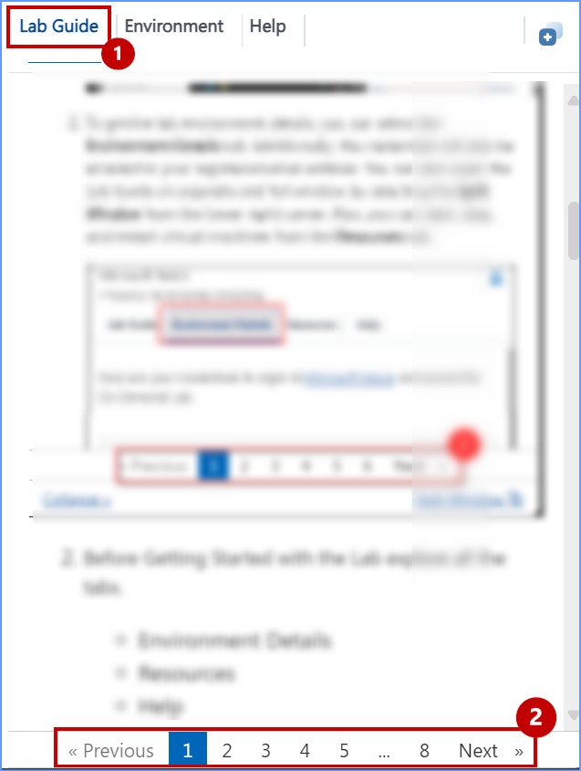
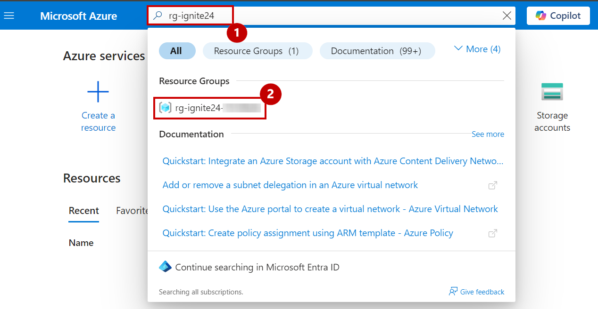
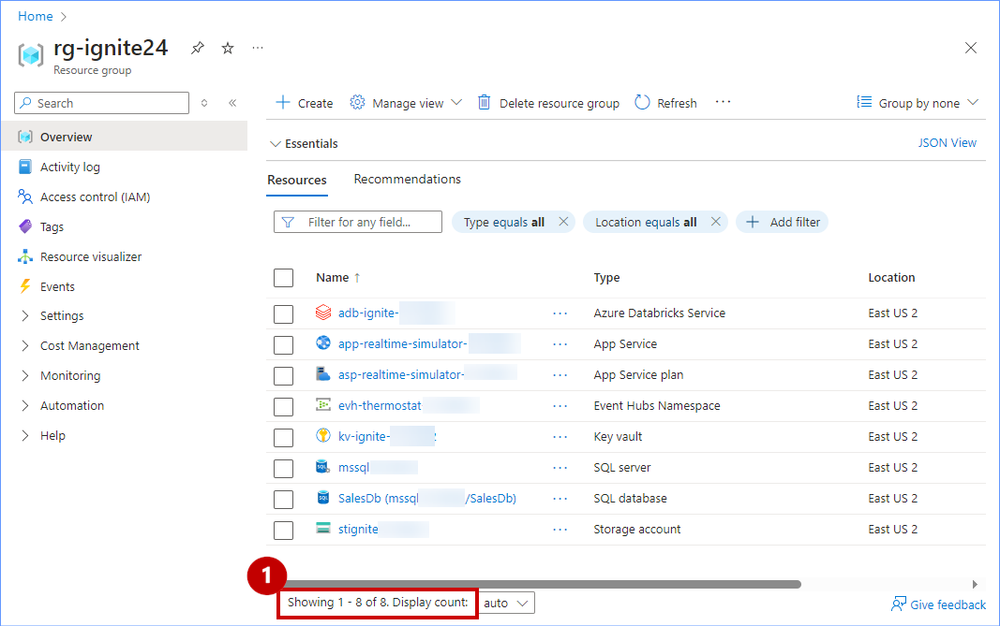

# Getting Started with Lab

1. Once the **Environment** is provisioned, a virtual Machine (JumpVM/Bastion) and **Lab Guide** gets loaded in your browser. Use this virtual Machine throughout the workshop to perform the lab. 

### Familiarize yourself with the Lab Environment, before you begin!

1. The **Lab Guide** tab contains all the steps required to complete the lab. You can use the numbers at the bottom of the **Lab Guide** to navigate between different **Exercises**.

2. Before starting the Lab, take a moment to explore the following tabs:

    - **Lab Guide**
    - **Environment**
    - **Help**

3. You can view the **Lab Guide** in a separate full window by selecting **Split Window**, or hide the **Lab Guide** by **collapsing it**, which slides it out of the right side of the screen.

# Log into Azure Portal

1. In the JumpVM/Bastion, **double click** on the **Azure Portal** shortcut of the Microsoft Edge browser on the desktop.

>**Note:** If the browser is not opening, **refresh** the main VM browser page.

2. If you see the pop-up notification to restore pages, click on  **"x"**  to close it.

3. On the **Microsoft Azure** browser tab, paste the provided **Username** to **Sign in** and click **Next**.

|                                                    |
------------------------------------------------------
|<inject key= "AzureAdUserEmail" enableCopy="true"/> |
------------------------------------------------------

4. Now paste the following **Password** and click on **Sign in**.

|                                                       |
---------------------------------------------------------
|<inject key= "AzureAdUserPassword" enableCopy="true"/> |
---------------------------------------------------------

5. Click on **Yes** button.

6. Click **No, Thanks** button on the pop-up prompting to **Sign in to Microsoft Edge**.

   
>**Note:** After logging into the Azure Portal, if a pop-up page titled **"Welcome to Microsoft Azure"** appears, click **Cancel** to skip the tour.

7. Now, on the **Azure Portal** Dashboard, click on Search bar to search and select the Resource Group as **rg-techconnect**.
   

>**Note:** To ensure the **deployment is successful!** Verify that the **Resource Group** contains **8 resources**.

This concludes the setup. You are now all set to explore the features and functionalities. Proceed to the next exercises, keeping the **Resource Group** tab open, and move forward with the next steps. **Happy Labbing!**
